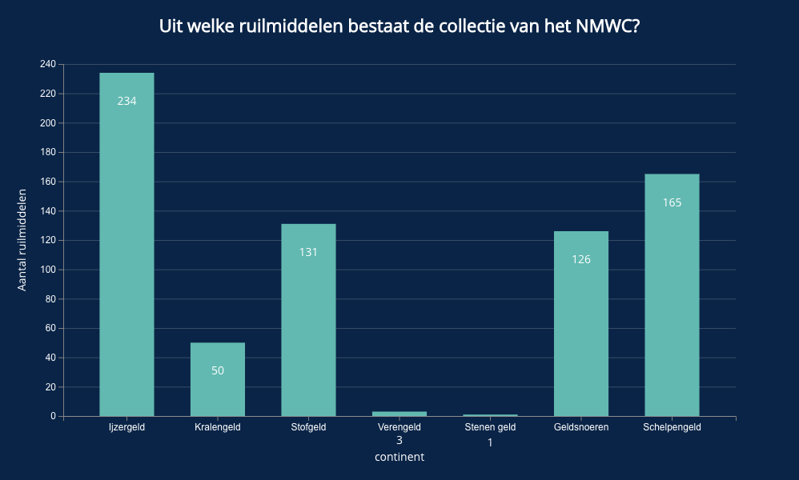
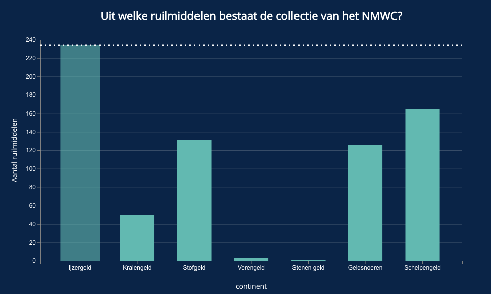

# functional-programming

Tijdens functional programming heb ik een datavisualisatie gemaakt voor het Nationaal Museum van Wereldculturen die collectiebreed en nuttig is voor het museum. Deze visualisatie gaat over de ruilmiddelen 




### Het concept:
De datavisualisatie laat zien hoeveel ruilmiddelen er zijn binnen de collectie van het NMWC binnen de catagorie Geld. Onder geld zitten weer verschillende soorten ruilmiddelen en met deze visualisatie kun je zien wat voor soort geld er is en hoeveel objecten er zijn binnen de verschillende categorieën.

- Je kunt met de muis over een categorie gaan en dan zie je een duidelijke lijn van hoeveel objecten er onder die categorie vallen.
- Uiteindelijk is de bedoeling dat je op elke categorie door kan klikken om zo bij de subcategorieën te komen en weer een nieuwe bar chart krijgt met meer inhoud.

Om meer te weten over mijn proces zie mijn [wiki](https://github.com/emmaoudmaijer/Frontend-applications/wiki/Het-concept-en-het-proces)

## Data & Query

De collectie van het NMWC bestaat uit meer dan 700000 objecten, dit is natuurlijk heel veel, maar ik wilde een kleiner deel van de collectie gaan pakken om daat iets interessants mee te laten zien. Daarom besloot ik om me te gaan focussen op ruilmiddelen. De data die ik heb gebruikt komt van het [NMWC](https://collectie.wereldculturen.nl/#/query/80b924c9-65af-47cd-ad25-d7be31beb0ef). De query die ik heb gebruikt om de data over de ruilmiddelen op te halen vind je hier onder. Ik heb de subcategorie 'geld' gepakt van de ruilmiddelen en daaronder goederengeld. Nu kun je dus in de visualisatie zien waar dat allemaal uit bestaat. Dit heb ik gedaan omdat je als bezoeker dan een beter beeld krijgt van wat voor soort ruilmiddelen er nou eigenlijk bestaan en in welke categorie deze horen.

```
PREFIX rdf: <http://www.w3.org/1999/02/22-rdf-syntax-ns#>
PREFIX dc: <http://purl.org/dc/elements/1.1/>
PREFIX dct: <http://purl.org/dc/terms/>
PREFIX skos: <http://www.w3.org/2004/02/skos/core#>
PREFIX edm: <http://www.europeana.eu/schemas/edm/>
PREFIX foaf: <http://xmlns.com/foaf/0.1/>

SELECT ?cat ?catLabel (COUNT(?cho) AS ?choCount) 
WHERE {
  # geef subtypes van ruilmiddelen
  <https://hdl.handle.net/20.500.11840/termmaster12591> skos:narrower/skos:narrower ?cat .
  ?cat skos:prefLabel ?catLabel .

  # geef de subcategorieen van ruilmiddelen
  ?cat skos:narrower* ?type .

  # geef objecten bij de onderliggende types
  ?cho edm:object ?type . 
  
} GROUP BY ?cat ?catLabel
```

## Data manipulatie
Hier vind je de link naar het inladen en het manipuleren van de data, dit kun je ook zien in de wiki
[Data manipulatie.js bestand](https://github.com/emmaoudmaijer/functional-programming/blob/master/datamanipulation.js)
[Wiki data manipulatie uitleg](https://github.com/emmaoudmaijer/functional-programming/wiki/data-manipulatie)

## Install

```
git clone https://github.com/emmaoudmaijer/functional-programming.git
```
```
cd functional-programming
```
```
npm install
```
## Special thanks
Hulp gehad met de data invoegen uit sparql door Kris Kuiper
## Licence

ISC - Emma Oudmaijer